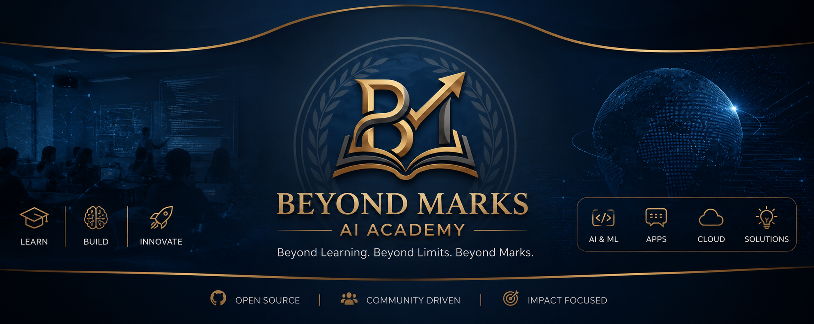

<!-- github-profile-readme -->

  

[**Website**](https://beyondmarks.ai) &nbsp;&nbsp;·&nbsp;&nbsp; [**Projects**](https://github.com/beyondmarks-ai?tab=repositories) &nbsp;&nbsp;·&nbsp;&nbsp; [**Follow on GitHub**](https://github.com/beyondmarks-ai?tab=followers)

## Building useful technology beyond the classroom

Beyond Marks AI Academy is an engineering-focused learning community in India. We build practical products across artificial intelligence, cybersecurity, developer tools, mobile applications, and the web—while helping the next generation learn by shipping real software.

- Building AI-powered tools with secure, server-side model integrations
- Exploring trustworthy software distribution and applied cybersecurity
- Shipping across Windows, Android, cloud, and the modern web
- Turning project-based learning into production-minded engineering

## Featured engineering

| Project | What it does | Core stack |
|---|---|---|
| [**AppForge**](https://github.com/beyondmarks-ai/App_Forger) | Discovers trusted Windows software, validates installer links, and verifies downloads with SHA-256 and Authenticode. | Python · PySide6 · Azure OpenAI |
| [**ThreatLens**](https://github.com/beyondmarks-ai/Threat-Lens) | Analyzes URLs for phishing signals, TLS issues, redirects, typosquatting, and threat-intelligence matches. | Go · Svelte · Docker |
| [**ShortcutX**](https://github.com/beyondmarks-ai/ShortcutX) | Maps mouse gestures and global shortcuts to productivity actions in Windows. | C# · WPF · .NET |
| [**Vaani Setu**](https://github.com/beyondmarks-ai/Vaani-Setu-Beta) | Connects users through real-time audio rooms using six-digit Vaani numbers. | Flutter · Firebase · LiveKit · Azure |
| [**Refiner**](https://github.com/beyondmarks-ai/Refiner) | Adds an AI-powered “Refine” action directly to Android's text-selection menu. | Flutter · Kotlin · Azure Functions |
| [**Beyond Marks Academy**](https://github.com/beyondmarks-ai/Beyond-Marks-AI-Academy) | Presents an AI-literacy and skill-mastery curriculum through a responsive education platform. | React · Vite · Framer Motion |

## Technology landscape

  <code>Python</code>&nbsp; <code>TypeScript</code>&nbsp; <code>C# / .NET</code>&nbsp; <code>Go</code>&nbsp; <code>Dart</code>&nbsp; <code>Kotlin</code>  
  <code>React</code>&nbsp; <code>Flutter</code>&nbsp; <code>Microsoft Azure</code>&nbsp; <code>Firebase</code>&nbsp; <code>Docker</code>&nbsp; <code>GitHub Actions</code>

## Open-source activity

**42 public repositories** &nbsp;·&nbsp; **Multi-platform engineering** &nbsp;·&nbsp; **AI and cybersecurity focus**

[Browse all repositories](https://github.com/beyondmarks-ai?tab=repositories) &nbsp;·&nbsp; [View releases](https://github.com/beyondmarks-ai?tab=repositories&q=&type=source&language=&sort=stargazers)

---

  <strong>Learn deeply. Build boldly. Share openly.</strong> 
  Beyond Marks AI Academy · Bidar, Karnataka, India

